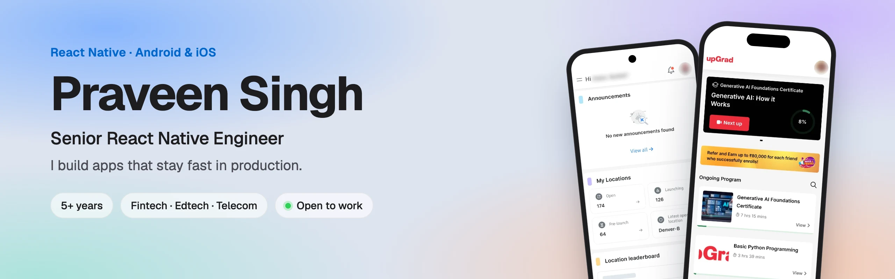
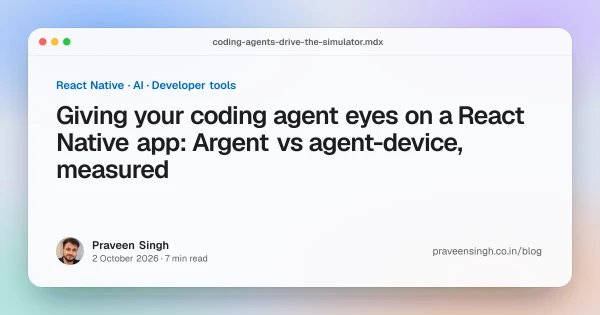
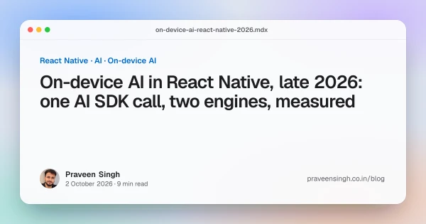
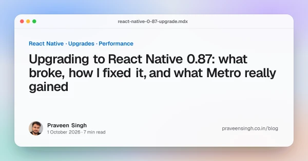
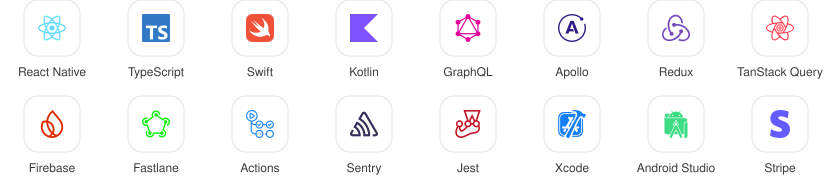

<picture>
  <source media="(prefers-color-scheme: dark)" srcset="assets/banner-dark.webp">
  
</picture>

  <a href="https://www.praveensingh.co.in"><b>Portfolio</b></a> &nbsp;·&nbsp;
  <a href="https://www.praveensingh.co.in/blog"><b>Blog</b></a> &nbsp;·&nbsp;
  <a href="https://www.praveensingh.co.in/resume"><b>Résumé</b></a> &nbsp;·&nbsp;
  <a href="https://www.linkedin.com/in/praveens2/"><b>LinkedIn</b></a> &nbsp;·&nbsp;
  <a href="mailto:praveen.codeit@gmail.com"><b>praveen.codeit@gmail.com</b></a>

> [!TIP]
> **Open to senior React Native and mobile roles, and to consulting.** I can join immediately: remote, hybrid or on-site.

I've spent 5+ years shipping React Native apps across fintech, edtech and telecom, from architecture to the App Store. I like the hard parts of mobile: upgrades and New Architecture migrations, native modules in Swift and Kotlin, production memory leaks, and lists that have to scroll smoothly on a cheap Android phone.

## 📱 Shipped to the stores

<table>
  <tr>
    <td width="33%" valign="top">
       
      <b>upGrad Learning</b> 
      Course video through native Swift and Kotlin modules, encrypted offline downloads, CodePush fixes  
      ⚡ Cold start <b>2.9 s → 1.8 s</b> 
      ⭐ <b>4.6</b> from 8.2K App Store ratings  
      
      
    </td>
    <td width="33%" valign="top">
       
      <b>Reevo</b> · UK fintech 
      Credit card app: Visa 3-D Secure, biometric sign-in, hardened against the OWASP Mobile Top 10  
      ⚡ Frame drops <b>9.2% → 3.8%</b> 
      ⚡ API response <b>−30%</b>  
      Private client app
    </td>
    <td width="33%" valign="top">
       
      <b>Delightree</b> 
      Offline-first audits for 150+ franchise brands: photo capture, queued sync, AI-powered SOP search  
      ⚡ Checklists moved to <b>FlashList</b> to end scroll jank   
      
      
    </td>
  </tr>
  <tr>
    <td width="33%" valign="top">
       
      <b>Invia Telecom</b> 
      Enterprise app for real-time usage, billing and alerts, built to security compliance  
      ⚡ Widget refresh <b>3.2 s → 1.9 s</b> 
      ⚡ Stale-data tickets <b>−38%</b>  
      Private client app
    </td>
    <td width="33%" valign="top">
       
      <b>upGrad Living</b> 
      Student housing: resident log-in, daily meal menus, services and amenities    
      
      
    </td>
    <td width="33%" valign="top">
       
      <b>kookooVoice</b> · agency client 
      A talking toy controlled over Bluetooth LE: one of 8 to 10 agency apps across e-commerce, NFC and IoT    
      
    </td>
  </tr>
</table>

Case studies for each app: <a href="https://www.praveensingh.co.in/#work">praveensingh.co.in</a>

## 🔬 Measured in public

I write about React Native by building something small and measuring it, then publishing the code and the raw numbers, failures included.

<table>
  <tr>
    <td width="33%" valign="top">
       
      <b>Can a coding agent drive a React Native app?</b> 
      Argent and agent-device both solved 12 of 12 runs; agent-device used a fifth of the tokens. 
      <a href="https://www.praveensingh.co.in/blog/coding-agents-drive-the-simulator">Read</a> · <a href="https://github.com/psingh2907/rn-agent-sim-lab">Code</a>
    </td>
    <td width="33%" valign="top">
       
      <b>How do on-device LLMs compare in React Native?</b> 
      Apple's guided generation returned valid JSON 20/20; a 1B ExecuTorch model, 2/20. 
      <a href="https://www.praveensingh.co.in/blog/on-device-ai-react-native-2026">Read</a> · <a href="https://github.com/psingh2907/rn-on-device-ai-lab">Code</a>
    </td>
    <td width="33%" valign="top">
       
      <b>What really breaks in the 0.87 upgrade?</b> 
      16 TypeScript errors, one runtime crash, two props that silently stopped working. 
      <a href="https://www.praveensingh.co.in/blog/react-native-0-87-upgrade">Read</a> · <a href="https://github.com/psingh2907/rn-087-upgrade-lab">Code</a>
    </td>
  </tr>
</table>

## 🧰 Toolbox

<picture>
  <source media="(prefers-color-scheme: dark)" srcset="assets/stack-dark.svg">
  
</picture>

 

  <b>Hiring for React Native, or need an upgrade, a native module or a performance fix?</b> 
  <a href="mailto:praveen.codeit@gmail.com">Email me</a> · <a href="https://www.linkedin.com/in/praveens2/">LinkedIn</a> · <a href="https://www.praveensingh.co.in">praveensingh.co.in</a>

